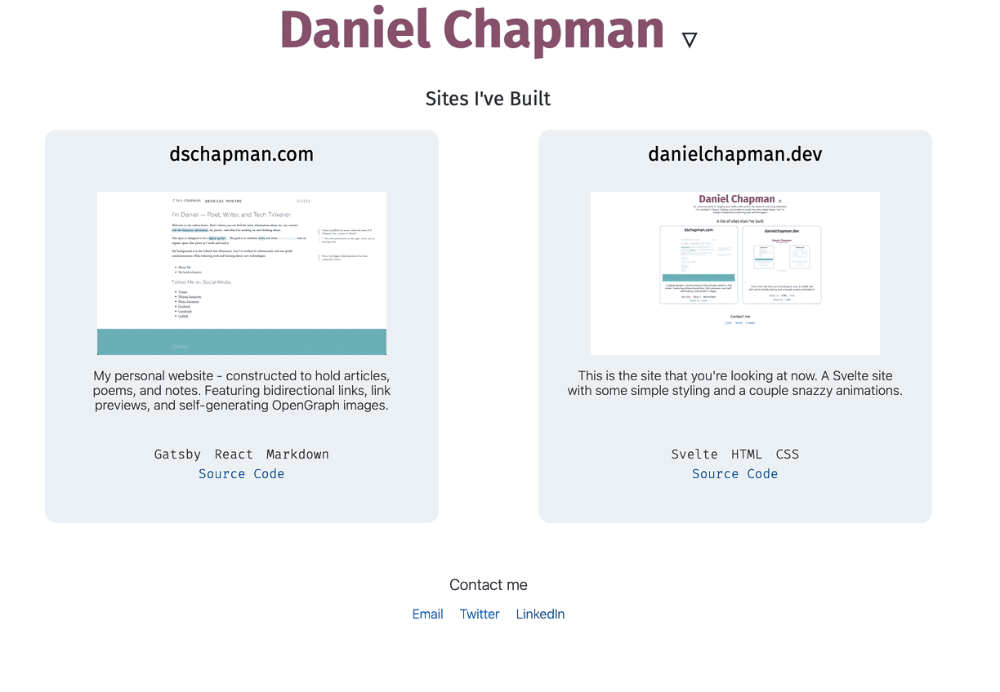

I recently used SvelteJS to create [a portfolio of websites I've built](https://danielchapman.dev). <Marginnote count={1}>Right now there's only two websites listed, but I'm sure it will expand over time.</Marginnote> The process of writing the website was fun -- figuring out the syntax of Svelte, using the lovely transition and animation libraries, and playing with event handlers. Here's a quick guide for how you can get started with Svelte.

## What is Svelte?

Svelte is a tool for building fast web applications. It's a bit similar to other frontend frameworks like React and Vue. Like React, Svelte constructs components, but unlike React which does its work in the browser at run time, Svelte compiles your app into optimized Javascript code.

I found that writing Svelte code is fun -- it's more like writing vanilla HTML or CSS than writing React -- and animations and transitions have first class support.

## Creating a Project with Svelte 3

There is a template that you can use as a starting point to create your Svelte project. In your terminal run:

```bash
npx degit sveltejs/template my-svelte-project
```

This will use npx to run <Tooltip tiptext="Degit is a tool that makes copies of git repositories. If you run `degit some-user/some-repo` it will find the latest commit on https://github.com/some-user/some-repo and download the associated tar file. This is faster than git clone because you're not downloading the entire git history.">degit</Tooltip> to create your svelte project.

Next go into the directory and run npm install.

```bash
cd my-svelte-project && npm install
```

Now that all the packages are installed you can start up the development server using `npm run dev` and see your website at <http://localhost:5000>. Your Svelte component is stored in the file `src/App.svelte`, although you can easily create additional components and import them into `App.svelte`.

## Basic Svelte Structure

A svelte file typically has a `script` tag, a `style` tag, and the svelte component. The `script` tags are where the brains of your Svelte component go -- variable and function declarations. The `style` tag is contains the CSS to style your component. And finally there's the svelte component, which for the most part you compose like you would with HTML or JSX, but there are some exceptions.

The most obvious exception are the if block, each block, and await block which are written in-line in the svelte component.

### If block

The if block displays certain components conditionally.

```html
{#if expression}
<div>
  This div is displayed conditionally.
</div>
{:else}
<div>
  Or this will be displayed
</div>
{/if}
```

### Each block

The each block cycles through an array and displays code a certain way.

```html
<ul>
  {#each items as item}
  <li>{item.name}</li>
  {/each}
</ul>
```

### Await block

The await block waits for asynchronous code to return and then displays content.

```html
{#await promise}
<p>Waiting for the promise</p>
{:then value}
<p>The value is {value}</p>
{/await}
```

## Svelte Transitions & Animations

The real star of my experience with Svelte has been the transitions and animations.



Transitions have first class support in Svelte, you just import the transition from svelte and attach it to the element you want to transition. For my website I created a `Bio` component so that if my name is clicked a short introduction will drop down. Implementing this in Svelte was straightforward. Here's my `Bio` component with the styles removed:

```jsx
<script>
  import { slide } from "svelte/transition";
  let visible = false;
  let symbol = "▽";
  export let intro;
</script>

<style>
  ...
</style>

<div class="bio">
  <span class="name" on:click={() => (visible = !visible)}>
    <h1>Daniel Chapman</h1>

    <span class="symbol">{visible ? 'x' : '▽'}</span>
  </span>
  {#if visible}
    <div class="about" transition:slide>
      <h2>About Me</h2>
      <div class="intro">{intro}</div>
    </div>
  {/if}

</div>
```

You'll see a few things here. First the `on:click` handler which toggles the `visible` variable. You'll also see that there's an if block whose contents will only display if `visible` is true. And finally in the `div` with the "about" class you'll see the `transition:slide` attribute; this tells Svelte how to transition the element when it gets attached to or removed from the DOM -- in other words whenever my name is clicked.

This is where the magic of Svelte started shining through for me. All I hd to do to add a fancy slide tranisition was to add the `transition:slide` attribute to a component.

Animations are a little trickier. I wanted a hover effect on the website cards I created so I created `on:mouseenter` and `on:mouseleave` handlers that use Svelte's [`tweened`](https://svelte.dev/docs#svelte_motion) function from `svelte/motion`. `tweened` is a function that starts at an initial value, then when you call `set(newvalue)`, it gradually moves from its initial value to the new value taking into consideration a `duration` in milliseconds and an `easing` function that effects how the value is incremented. I used this in combination with a style attribute to gradually animate CSS `box-shadow` when the mouse hovers over a website card.

The relevant code for the animation is below.

```js
<script>
  export let technologies = [];
  export let code = "";
  export let title = "There was no Title";
  export let description = "There was no Description";
  export let link;
  export let image = "";
  let hovered = false;
  import { onMount } from "svelte";
  import { fade, slide } from "svelte/transition";
  import { tweened } from "svelte/motion";
  import { cubicOut } from "svelte/easing";

  const shadow = tweened(0, { duration: 500, easing: cubicOut });

  function handleClick() {
    window.location = link;
  }

  function handleMouseEnter() {
    shadow.set(1);
    hovered = true;
  }

  function handleMouseLeave() {
    shadow.set(0);
    hovered = false;
  }

  let mounted = false;
  onMount(() => (mounted = true));
</script>
```

At the top of the code block I define a tweened function called `shadow` which will gets set to 1 in `handleMouseEnter()` and 0 in `handleMouseLeave()`<Marginnote>You'll also see the values `on:touchstart` and `on:touchend`, I discovered that these handle finger presses, so I set them to the equivalent mouse handler.</Marginnote>. It does this over the period of 1/2 a second and uses a cubic easing function (`cubicOut`) Now let's continue to look at the Svelte component below:

```jsx
{#if mounted}
  <div
    on:click={handleClick}
    on:mouseenter={handleMouseEnter}
    on:touchstart={handleMouseEnter}
    on:mouseleave={handleMouseLeave}
    on:touchend={handleMouseLeave}
    transition:slide={{ delay: 200 }}
    style="box-shadow: {$shadow * 30}px {$shadow * 15}px #925c77, {$shadow * 45}px
    {$shadow * 21}px #75B9BE, {$shadow * 60}px {$shadow * 30}px #7297A6;"
    class="site">
    <h2
      class="title"
      transition:fade={{ delay: 250 }}
      style="text-decoration: {hovered ? 'underline' : 'none'};">
      <a href={link}>{title}</a>
    </h2>
    
    <div class="description" transition:fade={{ delay: 500 }}>
      {description}
    </div>
    <div class="code">
      <ul>
        {#each technologies as technology}
          <li>{technology}</li>
        {/each}
      </ul>
      <a href={code}>Source Code</a>
    </div>
  </div>
{/if}

```

In the top-level div you'll see there is a style tag. Animating the CSS in Svelte was a simple matter of using the style tag, and because Svelte allows JS within the curly brackets multiplying the `shadow` variable (which moves from 0 to 1 when the mouse is hovered, and from 1 to 0 when the mouse is removed.) by different values to create the triple-layered shadow effect that you can see on the site.

## Conclusion

All in all it took less than a weekend from the moment I started learning Svelte watching [this 26 minute Egghead collection](https://egghead.io/playlists/getting-started-with-svelte-3-05a8541a) to when I finished the rough draft of [my Svelte website](https://danielchapman.dev). It might not have taken long, but it was long enough to show me that Svelte is a unique, fun language with powerful functionality.

The code for [my website is open source](https://github.com/dschapman/danielchapman-dev) and you are welcome to browse it, copy it, and tinker with it.
